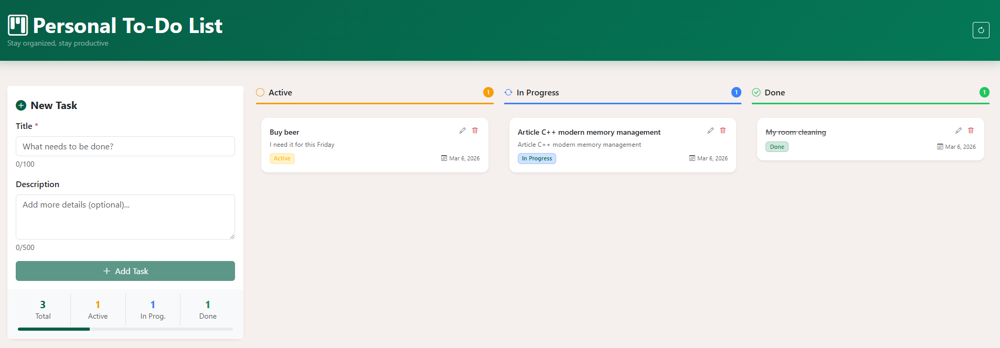

# Personal To‑Do List

A personal full-stack To-Do list app built with **React + TypeScript** (frontend) and **Express + SQLite** (backend), demonstrating scalable architecture and production best practices.



---

## Tech Stack

| Layer     | Technology                         |
|-----------|-------------------------------------|
| Frontend  | React 18, Vite, TypeScript, Bootstrap 5 |
| Backend   | Node.js, Express, TypeScript        |
| Database  | SQLite (better-sqlite3)            |
| Validation| Zod (shared schemas, both ends)     |
| HTTP      | Axios (client) + CORS middleware    |

---

## Project Structure

```
todo-app/
├── package.json              ← monorepo root (concurrently)
│
├── server/                   ← Express API
│   ├── src/
│   │   ├── index.ts          ← Entry point & DB bootstrap
│   │   ├── app.ts            ← Express app + middleware stack
│   │   ├── models/
│   │   │   └── taskModel.ts   ← SQLite schema + persistence mapping
│   │   ├── repositories/
│   │   │   └── taskRepository.ts ← Repository implementation
│   │   ├── controllers/
│   │   │   └── taskController.ts  ← CRUD + toggle handlers
│   │   ├── routes/
│   │   │   └── taskRoutes.ts ← Express Router
│   │   └── middleware/
│   │       ├── errorHandler.ts    ← AppError class + central handler
│   │       └── validateObjectId.ts
│   ├── .env.example
│   ├── tsconfig.json
│   └── package.json
│
└── client/                   ← React SPA
    ├── src/
    │   ├── main.tsx          ← React root
    │   ├── App.tsx           ← Root component & layout
    │   ├── index.css         ← Global styles
    │   ├── types/
    │   │   ├── componentProps.ts  ← shared component prop types
    │   │   └── hookTypes.ts       ← shared hook return types
    │   ├── services/
    │   │   └── taskService.ts ← Axios service layer
    │   ├── hooks/
    │   │   └── useTasks.ts   ← All task state + mutations
    │   └── components/
    │       ├── TaskForm.tsx  ← Create / edit form with validation
    │       ├── TaskItem.tsx  ← Task card with inline edit
    │       └── FilterBar.tsx ← All / Active / Completed filter
    ├── index.html
    ├── vite.config.ts
    ├── tsconfig.json
    └── package.json
```

---

## API Reference

| Method | Endpoint                  | Description                     |
|--------|---------------------------|---------------------------------|
| GET    | `/api/tasks`              | List tasks (supports `?completed=true&page=1&limit=20`) |
| GET    | `/api/tasks/:id`          | Get single task                 |
| POST   | `/api/tasks`              | Create task                     |
| PATCH  | `/api/tasks/:id`          | Update task (partial)           |
| DELETE | `/api/tasks/:id`          | Delete task                     |
| PATCH  | `/api/tasks/:id/toggle`   | Toggle completed status         |
| GET    | `/health`                 | Health check                    |

### Request / Response Shape

**Create / Update body:**
```json
{
  "title": "Buy groceries",
  "description": "Milk, eggs, bread",
  "completed": false
}
```

**Success response:**
```json
{
  "success": true,
  "data": {
    "_id": "664a1f...",
    "title": "Buy groceries",
    "description": "Milk, eggs, bread",
    "completed": false,
    "createdAt": "2024-05-20T10:30:00.000Z",
    "updatedAt": "2024-05-20T10:30:00.000Z"
  }
}
```

**Error response:**
```json
{
  "success": false,
  "message": "Validation failed",
  "errors": {
    "title": ["Title is required"]
  }
}
```

---

## Getting Started

### Prerequisites

- Node.js ≥ 18

### 1 · Install dependencies

```bash
cd todo-app
npm run install:all
```

### 2 · Run in development mode

```bash
# From the todo-app/ root:
npm run dev
# → API:    http://localhost:5000
# → Client: http://localhost:5173
```

### 3 · Build for production

```bash
npm run build:server   # compiles to server/dist/
npm run build:client   # outputs to client/dist/
```

---

## Key Architecture Decisions

### Shared Domain Types
All shared types live in `shared/types.ts`. The client and server both import from `@todo/shared` (via path alias), so the API contract remains consistent and easy to maintain.

### Persistence (SQLite + Repository)
The server persists tasks in SQLite (via `better-sqlite3`). The repository layer maps between the DB entity (`taskModel.ts`) and the shared domain model (`Task`).

### Optimistic UI Updates
`useTasks.ts` applies optimistic updates for toggle operations — the UI reflects the change instantly and rolls back if the API call fails.

### Layered Error Handling
- Zod validates incoming payloads in controllers, producing structured `errors` objects.
- `AppError` represents known operational errors (404, 400) with appropriate HTTP codes.
- The central `errorHandler` middleware normalizes all failures into the same `{ success, message }` format.

### Proxy in Development
Vite proxies `/api/*` to `localhost:5000`, so the client doesn’t need a separate API base URL.
